# FLUXO_LOGIN.md — Diagrama do fluxo de login da DLL (CABAL_Login.dll)

> Fluxo desejado completo. Marcação por tipo de chamada:
> - 🎹 **teclado (SendInput)** — determinístico, sem coordenadas
> - 🧠 **função do jogo (chamada direta)** — o que queremos evoluir
> - 📍 coordenadas (fallback/legado) — a eliminar

```mermaid
flowchart TD
    S["Início — DLL injetada, espera gatilho (F8 / login.go)"] --> A

    A["1. Login: digita usuário, Tab, senha, Enter"]:::kb
    A --> B["2. Servidor: navega lista → seleciona MERCÚRIO"]:::kb
    B --> C["3. Canal: seleciona canal (ex.: 9) → conecta (0x8C)"]:::kb
    C --> D["4. Personagem: navega → Iniciar → 0x8E EnterWorld"]:::kb
    D --> E["5. Subsenha (se houver): digita + OK"]:::kb
    E --> F["6. DENTRO do mundo"]:::done

    F --> G["7. Verifica: lê ouro / nível / nome<br/>(base+0x137F180)"]
    G --> H["8. Abre inventário (I) — toggle_ui 0<br/>0x549FD8"]:::fn

    H --> I["9. MENU O — toggle_ui 2<br/>0x549FD8"]:::fn
    I --> J["10. Selecionar Servidor — função<br/>0x14034F890 (fecha só o mundo)"]:::fn
    J --> K["11. Confirma 'Sim' — ação do diálogo"]:::fn

    K --> L["12. Tela de seleção → VÊNUS"]:::kb
    L --> M["13. Canal 2 → personagem → subsenha → entra"]:::kb
    M --> N["14. Verre + print (I)"]:::fn

    N --> O["15. Menu O → Desconectar — função<br/>0x140356B30 (fecha as DUAS conexões)"]:::fn
    O --> P["16. Tela de login → próxima conta (loop)"]

    classDef kb fill:#1e3a5f,color:#fff,stroke:#3b82f6
    classDef fn fill:#14532d,color:#fff,stroke:#22c55e
    classDef done fill:#555,color:#fff
```

## Funções do jogo JÁ chamadas direto (compilado na DLL)

| Ação | Endereço | Como a DLL chama |
|---|---|---|
| Abrir menu O | `base+0x549FD8` | `login_toggle_ui(LOGIN_UI_MENU)` |
| Abrir inventário I | `base+0x549FD8` | `login_toggle_ui(LOGIN_UI_INVENTORY)` |
| **Desconectar** (fecha as 2 conexões → login) | `base+0x356B30` | `login_do_disconnect()` — this = buffer zerado |

## Pendentes (próximas iterações)

| Ação | Endereço identificado | Status |
|---|---|---|
| **Selecionar servidor** (fecha só o world) | ~`0x14034F890` | assinatura a confirmar (não ligado na DLL ainda) |
| Conectar canal (0x8C) | `0x140740f82` / `0x140A01A00` | mecanicamente profunda — mapa em FLUXO_UI.md |
| Confirmar "Sim" | handler do diálogo (`EventSet` std::function) | RE em andamento | 

## Como ler um passo
- **Verde**: função do jogo chamada direta (não usa teclado/coordenadas).
- **Azul**: teclado determinístico (a navegação nativa da lista — não usa coordenada fixa).
- O objetivo: migrar cada 📖 "🍯 teclado" para 🧠 "função direta" conforme a RE avança.